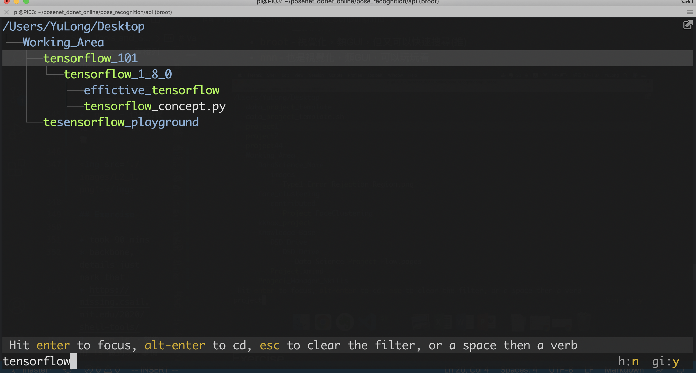

# L2 Shell Tools and Scripting 

# Variables

在command line可以直接指定變數

``` 

(base) YuLong@MacBook-Pro:~/Desktop$ foo=bar
(base) YuLong@MacBook-Pro:~/Desktop$ echo $foo
bar
```

shell預設是空格即間隔，這和其他程式語言(例如Python)不太一樣，所以以下不會work

``` 

(base) YuLong@MacBook-Pro:~/Desktop$ foo = bar
-bash: foo: command not found
```

單引號和雙引號的字串格式都是被接受的

``` 

(base) YuLong@MacBook-Pro:~/Desktop$ echo "HELLO"
HELLO
(base) YuLong@MacBook-Pro:~/Desktop$ echo 'abc'
abc
```

但雙引號裡面是可以放變數的，如下，變數為 `$foo`

單引號則為plain text(純文字格式)

``` 

(base) YuLong@MacBook-Pro:~/Desktop$ echo "Value is $foo"
Value is bar
(base) YuLong@MacBook-Pro:~/Desktop$ echo 'Value is $foo'
Value is $foo
```

# Functions

shell也能夠有邏輯判斷，迴圈，函數等，以下示範函數

``` 

(base) YuLong@MacBook-Pro:~/Desktop$ vi mch.sh
```

以下函數會吃一個positional argument，開新資料夾，並且將當前路徑進入到該資料夾中

``` 

mcd () {
    mkdir -p "$1"
    cd "$1"
}

```

# Special Variables

shell當中設計了不少特殊變數，像是 `$1, $2, $? $*, $@` ，可以參考[這裡](https://www.itread01.com/p/200789.html)，這使得sh檔案更輕便簡潔(也更難讀懂就是了....)，這和shell這門語言的設計理念有關係

| special variable | meaning                             | note |
|------------------|-------------------------------------|------|
| `$0` | file name                           |      |
| `$1` | first positional argument           |      |
| `$2` ~ `$9` | second to ninth positional argument |      |
| `$*` | all of the positional arguments     |      |
| `$#` | number of arguments we gave to the program     |      |
| `$$` | PID which processing the program    |      |
| `$?` | lastest command succeed or not    |  successed -> 0    |

# Special Command

shell 設計了很多方便的command來幫助我們快速的和linux系統互動

`!!` means lastest command, like you don't have a permission.

``` 

(base) YuLong@MacBook-Pro:~/Desktop$ vi /System/Volumes/Data/Users/Shared/macenhance/520974.padl

permission denied

(base) YuLong@MacBook-Pro:~/Desktop$ sudo !!
sudo vi /System/Volumes/Data/Users/Shared/macenhance/520974.padl

```

`||` means or, if failed by first command, try second command.

``` 

(base) YuLong@MacBook-Pro:~/Desktop$ false || echo "Oops failed"
Oops failed
```

`&&` - only run the second command only the first command is successed.

``` 

(base) YuLong@MacBook-Pro:~/Desktop$ false && echo "First command successed"
(base) YuLong@MacBook-Pro:~/Desktop$ True && echo "First command successed"
First command successed

```

`;` - always do the following command

``` 

(base) YuLong@MacBook-Pro:~/Desktop$ True ; echo "First command successed"
First command successed
(base) YuLong@MacBook-Pro:~/Desktop$ False ; echo "First command successed"
First command successed

```

# Shell Wildcard

wildcard一般翻譯程通配符，通用符號，和正則表達式的匹配很像，但是更簡便 

| symbol | meaning     | example                         |
|--------|-------------|---------------------------------|
| `*` | all matches | `ls *.py` <br> list all .py file |
| `?` | single character | `ls project?` <br> list project1, project2, projectq, ... |
| `{}` | including | 1. `ls *.{py,sh}` <br> list all .py and *.sh file <br> 2. touch{1, 2, 3, 4, 5}.py <br> touch 1.py, 2.py, ... 5.py|
| `..` | chracter ranger | touch{foo, bar}/{a..j} <br> touch foo/a foo/b, ...foo/j and bar/a, bar/b, ... boo/j|

[更多的wildcard](https://tldp.org/LDP/GNU-Linux-Tools-Summary/html/x11655.htm)

## Example Script

1. 一隻會查找給予的檔案(arguments)中有沒有包含`foobar`，沒有就會加進去到檔案最後一行的一隻script

``` 

#!/bin/bash

echo "Starting program at $(date)" # Date will be substituted

echo "Running program $0 with $# arguments with pid $$"

for file in $@; do
    grep foobar $file > /dev/null 2> /dev/null
    # When pattern is not found, grep has exit status 1
    # We redirect STDOUT and STDERR to a null register since we do not care about them
    if [[ $? -ne 0 ]]; then
        echo "File $file does not have any foobar, adding one"
        echo "# foobar" >> "$file"
    fi
done
```

5. 各種test 可以`man test`，在上面的script中是 `-ne` 表示 `!=`，test要用雙中括號包起來，例如`[[$? -ne 0]]`

6. 子進程與父進程，參考鳥哥，比較清楚，script中的要進到父進程的話，要export

7. 第一行的直譯器位置，叫做shebang，像是

    腳本的第一行 : `#!/usr/bin/env python.`

    有趣的地方是，你可以用一個用shell來執行.py檔案，shell會在檔案第一行找到用哪個直譯器去找該檔案

    透過這個邏輯你可以設定成你希望他跑的虛擬環境直譯器
    這使得檔案更容易攜帶與協作，能夠在不同機器，不同環境中運作

8. shell debugging

    當然你可以在vscode裡面找到shell的debuger
    然而也有其他工具可以幫助你，例如

    [shellcheck online](https://www.shellcheck.net/)

    [shellcheck github](https://github.com/koalaman/shellcheck)

    or just type : `brew install shellcheck`

## Finding What You Want

### Finding command quickly

tldr : 別上網google查command了，tldr幫你整理好直接查，tldr意思是(too long don't read)

``` 

(base) YuLong@MacBook-Pro:~/Desktop$ tldr ffmpeg

ffmpeg

Video conversion tool.
More information: <https://ffmpeg.org>.

* Extract the sound from a video and save it as MP3:

    ffmpeg -i video.mp4 -vn sound.mp3

* Convert frames from a video or GIF into individual numbered images:

    ffmpeg -i video.mpg|video.gif frame_%d.png

* Combine numbered images (frame_1.jpg, frame_2.jpg, etc) into a video or GIF:

    ffmpeg -i frame_%d.jpg -f image2 video.mpg|video.gif

* Quickly extract a single frame from a video at time mm:ss and save it as a 128x128 resolution image:

    ffmpeg -ss mm:ss -i video.mp4 -frames 1 -s 128x128 -f image2 image.png

* Trim a video from a given start time mm:ss to an end time mm2:ss2 (omit the -to flag to trim till the end):

    ffmpeg -ss mm:ss -to mm2:ss2 -i video.mp4 -codec copy output.mp4

* Convert AVI video to MP4. AAC Audio @ 128kbit, h264 Video @ CRF 23:

    ffmpeg -i input_video.avi -codec:audio aac -b:audio 128k -codec:video libx264 -crf 23 output_video.mp4

* Remux MKV video to MP4 without re-encoding audio or video streams:

    ffmpeg -i input_video.mkv -codec copy output_video.mp4

* Convert MP4 video to VP9 codec. For the best quality, use a CRF value (recommended range 15-35) and -b:video MUST be 0:

    ffmpeg -i input_video.mp4 -codec:video libvpx-vp9 -crf 30 -b:video 0 -codec:audio libopus -vbr on -threads number_of_threads output_video.webm    
```

看起來蠻有用的，但有時候可能裡面沒有還是要google就是了....

但有些好處，比如說筆者自己對find, rename其實不算很熟，但每次找東西重新google或是重新翻筆記又很煩，這時候就可以

tldr rename

tldr find

tldr docker(好實用!!!)

tldr brew(好實用!!!)

tldr tar(好實用!!!)

tldr zip(好實用!!!)

## finding file/folder quickly

當然你可以一直ls，一直ls，grep，找到你要的，再繼續ls下去，但是有時候你要從整個系統知道某個資料夾或是某個檔案到底安裝到哪裡去了，怎麼辦呢?

`find` and `fd`

現學現賣，馬上先

 `tldr find`

``` 

* Find files by extension:

    find root_path -name '*.ext'

* Find files by matching multiple patterns:

    find root_path -name '*pattern_1*' -or -name '*pattern_2*'

* Find directories matching a given name, in case-insensitive mode:

    find root_path -type d -iname '*lib*'

* Find files matching a path pattern:

    find root_path -path '**/lib/**/*.ext'

```

* `find` 可以同時搭配`exec`，找到之後搭配執行動作

``` 

# Delete all files with .tmp extension

find . -name '*.tmp' -exec rm {} \; 

# Find all PNG files and convert them to JPG

find . -name '*.png' -exec convert {} {.}.jpg \; 

```

* 通常都會使用pattern，就是上面的Globbing，所以可以多了解這個部分
* `fd`是一個比`find`更使用者友善的指令集，像是他的ouptut會有顏色，預設只用正則表達式，support unicode(可以搜尋中文)，以及其他指令更為直覺等
* 大部分的會同意`find`以及`fd`是好東西，但是他們有時候效能不太好，這時候可以查一下`locate`的使用，`locate`，關於`locate`的更多解釋可以看[這裡](https://unix.stackexchange.com/questions/60205/locate-vs-find-usage-pros-and-cons-of-each-other)
* `located`更像是database會根據index來找東西，通常可以找得更快，如果你find/fd用的不順找得很慢，那你可能會想試試看located

## The content of the file

`grep` and `rg`

* `grep`可以幫助你這個忙，在`data wrangling`我們會講更多

例如 : 

1. grep foobar mcd.sh - 在mcd.sh中找到foobar然後列出來
2. grep -R foo . - 在現在所在的資料夾找所有檔案，看看有裡面內容有沒有foo，有就列出來
3. 當然你可以看一下懶人包 `tldr grep`

自己在terminal上測試的話可以感覺得到grep沒有空行，沒有顏色，不算很好用，因此有了 `rg` ，rg可以視為更快速，更易閱讀的grep

``` 

# Find all python files where I used the requests library

rg -t py 'import requests'

# Find all files (including hidden files) without a shebang line

rg -u --files-without-match "^#!"

# Find all matches of foo and print the following 5 lines

rg foo -A 5

# Print statistics of matches (# of matched lines and files )

rg --stats PATTERN

```

## Finding your old command

* `histroy`

搭配一下想找的指令， `history | grep find`

* 另一個很酷的東西，講師自己非常喜歡的則是`history-based autosuggestions`，首先介紹一下[`fish`](https://fishshell.com/) shell, [fish-shell github](https://github.com/fish-shell/fish-shell)，這個東西可以在你的[zsh](https://asciinema.org/a/37390)中
* 其中一點要注意的是，這樣的工具會紀錄你輸入過的東西，所以像是一些敏感資訊，要把它們拿掉，這可以從`.bash_history`或是`.zhistory`中調整

## Folder Navigation

* `ls -R` - 最古老可用
* `tree` - 直接列出來
* `broot` - 視覺化，類GUI，但又可以快速搜尋(推)
* `nnn` - 也是視覺化，類GUI，可以玩玩看

</img>

## Summary of Good Shell Tools

| tool  | usage                  | note |
|-------|------------------------|------|
| tldr  | faster tool cheatsheet |      |
| fd    | faster find            |      |
| broot | faster , prettier tree |      |
| rg    | readable grep          |      |

## Exercise

* took 90 mins
* backbone, details just mark that
* https://missing.csail.mit.edu/2020/shell-tools/
1. `man ls`，然後用`ls`做到以下事情
  + Q : 列出檔案，包含隱藏的 
  + A : `ls -a`,                                                                               `ls -A`
  + Q : 包含檔案大小資訊，人獨得懂的
  + A : `ls -lh`
  + Q : 列出所有檔案(包含隱藏檔案)，但是是按照新舊順序排序
  + A : `ls -alt`
  + A2 : bouns `ls -altr` : 加上反排序 `-r` : `reverse`
  + A3 : bonus man很長，關鍵是sort, 所以可以 `man ls | grep sort`來查找相關命令
  + Q : 讓輸出有顏色
  + A : `ls -aG`，但是如果預設你的`.bashrc`,                                                                               `.bash_profile`ˇ經有設置，可能就沒差

2. 寫兩個bash function,                                                                               `marco` and `polo`

   1. 執行 `marco` 時，會將當前的工作路徑存在某個地方
   2. 執行 `polo` 時，不管輸入什麼工作路徑，都要進入到 `marco` 儲存的工作路徑
   3. 為了讓debug簡單一點，你可以寫好marco.sh然後把他載入到父進程 `source marco.sh`

   A : 

``` 

   #!/bin/bash

    marco () {
        curr_dir=$PWD
    }

    polo () {
    cd $curr_dir
    }

   

```

   A2 : Hint 把test.sh source到父進程可以快速debug，terminal重開變數就會清掉了

3. 假設以下情境，你有一個很少失敗的命令，但是為了debug，你必須抓到他的output，但是這個過程跑很久容易失敗，寫一隻bash script，把arguments輸入以下script，然後等到他failed，抓出他的standard output以及error streams寫到file中，並且把output以及error stream都print出來，bonus term : 如果你可以算出該程序跑了幾次

   A : 使用 `$?` - 上一個command執行的狀態碼，來進行if-else判定， `>>, >` 來重定向stdout， `2>, 2>>` 來重定向stderr
   A : 萬物皆檔案，先存，再用檔案操作，變數的思考觀點可能會比較難做
   

``` 

    #! /bin/bash
    # 此file會測試某個script，200次，並將output以及錯誤訊息寫到當前目錄中的curr.out
    for i in `seq 1 200` ;
    do
        # 把參數的file跑起來，stdout以覆蓋模式存在curr.out，stderr已覆蓋模式存在curr.err
        bash $1 > curr.out 2> curr.err 
        # 如果跑失敗，capture
        
        if [[ $? -ne 0 ]]; then
            # 存在一個file，稱為8_3_result.md
            echo "$i failed" 
            echo "ITERATION $i" >> 8_3_result.md
            echo "STDOUT BLOW" >> 8_3_result.md
            cat curr.out >> 8_3_result.md
            echo "ERROR BLOW" >> 8_3_result.md
            cat curr.err >> 8_3_result.md
            echo "Bug Captured! at iteration $i"
        fi
    # 	echo "$i successed"
    done
    rm curr.out
    rm curr.err

   ```

   

4. 這節課我們講到了`find`以及`-exec`參數，這個組合在檔案操作以及搜尋時非常實用，但是如果我們需要對全部的檔案做操作呢? 例如壓縮成一個zip file，如同你目前所見，命令列會從arguments以及STDIN來收取input，當我們使用`pipe`時，我們將STDOUT連接到STDIN，但是一些命令像是`tar`是從arguments接受input的，將這兩者整合的是`xargs`命令(mac有內建)，該命令會將STDIN也是為arguments，例如`ls | xargs rm`，會將所有現在工作目錄的檔案全部刪除(小心不要做這件事....)，你的任務就是**寫一個command，他會遞迴地找倒在資料夾中所有HTML file而且把他們zip起來，並且注意，你的command甚至要在file name有空白的情況下也能運作(可以看看`xargs`的`-d`參數)**

   **PASS**

5. (進階題) 寫下一個command或是script，找出一個工作目錄中最近其修改的檔案(需要進入資料夾中的資料夾(recursively))，或者更廣義來說，你可以把所有檔案列出來並且按照修改日期排序嗎?

    **PASS**

# additinal matrials

1. shell腳本中的算術運算 - 跟著阿銘學linux，第12章，shell script
2. [Update your bash to 5.0 in order to deubger support on VSCode 2.5k+](https://itnext.io/upgrading-bash-on-macos-7138bd1066ba)
