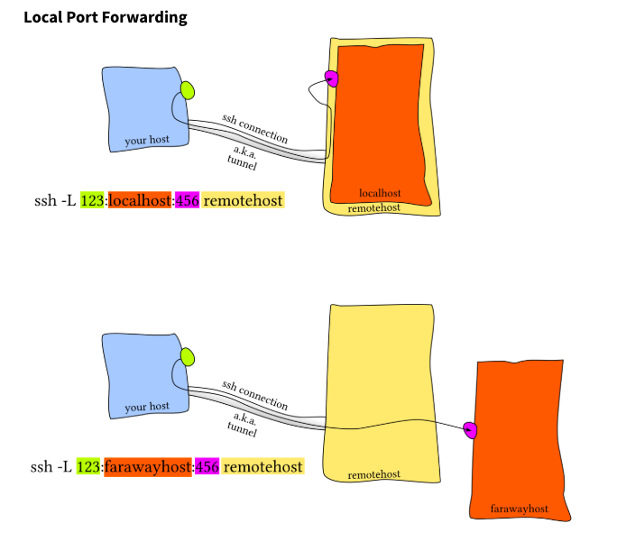

# Intro
* 這一節裡面我們會講到多個招式讓你用shell來加速你的工作流程，之前我們講了蠻多指令用法，現在我們會講怎麼同時執行他們，並且追蹤，這樣的技巧可以讓你不論在本地端還是遠端都能夠增加工作效率

# Job Control
`ctrl + C` : 中斷
`kill` : 殺掉進程
`fg`, `bg` : 把程式拉到前景，丟到背景，`bg`等同於(`ctrl + Z`)
`jobs`: 列出目前的使用者控制的process
`ps` : 列出所有進程(process status)
`&` : 丟到背景
`nohup` : 丟到背景而且把stdout寫到nohup.out，可以被重定向
```
$ sleep 1000
^Z
[1]  + 18653 suspended  sleep 1000

$ nohup sleep 2000 &
[2] 18745
appending output to nohup.out

$ jobs
[1]  + suspended  sleep 1000
[2]  - running    nohup sleep 2000

$ bg %1
[1]  - 18653 continued  sleep 1000

$ jobs
[1]  - running    sleep 1000
[2]  + running    nohup sleep 2000

$ kill -STOP %1 - 可以用編號而非pid
[1]  + 18653 suspended (signal)  sleep 1000

$ jobs
[1]  + suspended (signal)  sleep 1000
[2]  - running    nohup sleep 2000

$ kill -SIGHUP %1
[1]  + 18653 hangup     sleep 1000

$ jobs
[2]  + running    nohup sleep 2000

$ kill -SIGHUP %2

$ jobs
[2]  + running    nohup sleep 2000

$ kill %2
[2]  + 18745 terminated  nohup sleep 2000

$ jobs

```

# 多工(Terminal Multiplexers)
* [tmux for ubunutu](http://man7.org/linux/man-pages/man1/tmux.1.html)

# 別稱(Aliases)
```
# Make shorthands for common flags
alias ll="ls -lh"

# Save a lot of typing for common commands
alias gs="git status"
alias gc="git commit"
alias v="vim"

# Save you from mistyping
alias sl=ls

# Overwrite existing commands for better defaults
alias mv="mv -i"           # -i prompts before overwrite
alias mkdir="mkdir -p"     # -p make parent dirs as needed
alias df="df -h"           # -h prints human readable format

# Alias can be composed
alias la="ls -A"
alias lla="la -l"

# To ignore an alias run it prepended with \
\ls
# Or disable an alias altogether with unalias
unalias la

# To get an alias definition just call it with alias
alias ll
# Will print ll='ls -lh'

```

# Dotfiles

一些組態檔
bash : `.bashrc`, `.bash_profile`
git : `~/.gitconfig`
vim : `~/.vimrc`,`~/.vim` folder
ssh : `~/.ssh/config`
tmux : `~/.tmux.conf`

1. 這些東西都非常好移植，cp就可以移植了
2. 最好一直確保備份著他們，這使你在任何地方都有相同的工作環境
3. [也可以參考別人的config](https://github.com/search?o=desc&q=dotfiles&s=stars&type=Repositories)
4. 可以根據機器來客製化

```
   if [[ "$(uname)" == "Linux" ]]; then {do_something}; fi

# Check before using shell-specific features
if [[ "$SHELL" == "zsh" ]]; then {do_something}; fi

# You can also make it machine-specific
if [[ "$(hostname)" == "myServer" ]]; then {do_something}; fi
```

## 遠端機器(Remote Machine)
SSH : Secure Shell
`ssh foo@bar.mit.edu` 網域名稱
`ssh foo@ip address` ip位置 都是通的
通常還會搭配執行使用指令，例如
`ssh foobar@server ls` 遠端之後ls
你要安全連線總要有鑰匙吧
ssh key放在`~/.ssh/id_rsa`
還有ssh-keygen，可以google一下
從短端機器copy檔案
`ssh + tee` : cat localfile | ssh remote_server tee serverfile
`scp` : 單個file的copy
`rsync` : 如果你想要copy一整個資料夾，你會希望連線中斷的時候不會斷掉 `rsync -avP . wjadmin@192.168.0.176:xxx`
### ssh config
`vi ~/.ssh/config`

```
# Read more about SSH config files: https://linux.die.net/man/5/ssh_config

Host vm2_yltsai
     user yltsai
     hostname 35.236.168.4
     port 22
     IdentityFile ~/.ssh/GCPJobHunter

Host vm2_cyulong0609
     user cyulong0609
     hostname 35.236.168.4
     port 22
     # not work

Host instance2
     user yltsai
     hostname 35.221.143.151
     port 22
     IdentityFile ~/.ssh/GCPJobHunter

Host WEJUMP-RTX-2080
     user wjadmin
     hostname 192.168.0.176
     port 22
     # password needed

Host WEJUMP-Pi
     user pi
     hostname 192.168.0.107
     port 22
     # password needed

Host WEJUMP-Pi02
     user pi
     hostname 192.168.0.129
     port 22
     # password needed

Host WEJUMP-Nuke-Pi02
     user pi
     hostname 192.168.50.110
     port 22
     # password needed

Host WEJUMP-Nuke-Big
     user wjadmin
     hostname 192.168.50.14
```
* 原本你用的vscode就是從這裡來讀ssh config
* 也可以直接用ssh讀取, 例如`ssh WEJUMP-RTX-2080`，就像是直接建立了一個別名
## Port Forwarding
在很多場景下你比須給定本地端的port讓軟體跑起來，像是`localhost:PORT` or `127.0.0.1:PORT`
但是如果你希望這個port可以連到遠端，應該要怎麼做?
這樣的招數叫做`port forwarding`
其實就是跳板的概念 : 

</img>

如果你想要回到家控制mac，mac是接家裡網路，那麼就要轉到port 5900 的iMac Pro(遠端桌面需要透過VNC協定)，如果想要連回家裡的Synology NAS聽音樂，那麼就要轉到PORT 5000

Port Forwarding主要有兩種方式，Local Port Forwarding以及Remote Port Forwarding

### Local Port Forwarding
</img>

### Renmte Port Forwarding

</img>

* 一個最常見的情況是local port forwarding, 遠端機器開了一個通道，裡面有你想要的功能(像是jupyter notebook server)，然後你建立一個`ssh`通道到自己筆電端的`localhost:9999`，那麼你就需要這樣做

1. 遠端機器 `jupyter notebook --port=8999`(8888是預設，我們避開它)
   * 或是你可以jupyter notebook -no-browser --port=8999
2. 在你的本地端機器，建立ssh通道`ssh -N -L localhost:8888:localhost:8999 wjadmin@192.168.0.176`
   * 你也可以加上`-f`, 會讓ssh在背景執行
   * `-N` : no remote commands will be excuted
   * `-L` : local port foforwarding config
3. 你可以在本地端機器做process檢查
   * ps aux | grep localhost:8999
以上行為不一定要`jupyter` server，可以是任何的內容，也可以反過來聽，也可以經過跳板

# 其他有的沒的(Miscellaneous)
* 一個普遍遇到連接遠端機器的痛苦就是斷線(包含像是本地端shutdown, 本地端sleeping, 網路組態改變)
* 另一個痛苦則是連線變得越來越lag
* 關於這樣的問題是有解的，可以使用[Mosh](https://mosh.org/), the mobile shell

</img>

* 有時候你只是想要一個遠端的資料夾(就像NAS這樣)，[sshf](https://github.com/libfuse/sshfs)可以把遠端的file system掛載在你的local端，那麼你就可以使用local端來進行編輯了

## Shells & Frameworks
* 我們現在還是使用`bash`是因為他到處都可以看到，但是現在其實有更多其他的shell，也都很好用
* 例如`zsh`，有bash的所有功能，而且也更方便的地方
  * Smarter globbing, **
  * Inline globbing/wildcard expansion
  * Spelling correction
  * Better tab completion/selection
  * Path expansion (cd /u/lo/b will expand as /usr/local/bin)
* Framework可以讓你的shell變的很好，以下複製貼上XD，個人覺得fish還不錯，那個自動提示以前打過的command的部分感覺很不錯

Frameworks can improve your shell as well. Some popular general frameworks are **prezto** or **oh-my-zsh**, and smaller ones that focus on specific features such as **zsh-syntax-highlighting** or **zsh-history-substring-search**. Shells like **fish** include many of these user-friendly features by default. Some of these features include:

Right prompt
Command syntax highlighting
History substring search
manpage based flag completions
Smarter autocompletion
Prompt themes
One thing to note when using these frameworks is that they may slow down your shell, especially if the code they run is not properly optimized or it is too much code. You can always profile it and disable the features that you do not use often or value over speed.

## Exercise
pass

有包含Dotfiles到新主機上的安裝，還不錯。

## Additional Material
[通訊埠轉發 Port Forwarding 設定教學：如何從外面連回家中 NAS？](https://ningselect.com/30752/58/)

[VNC Wiki](https://zh.wikipedia.org/wiki/VNC)

[Remote Access to IPython Notebooks via SSH](https://coderwall.com/p/ohk6cg/remote-access-to-ipython-notebooks-via-ssh)