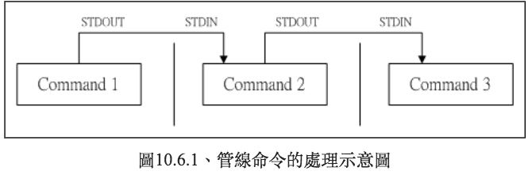

# handy linux commands/tips

> 紀錄工作中常用到的一些bash指令，以及使用場景
> 查看當前bash版本 `help`

# Backup, packing, unpacking

|命令|使用場景|備註|
|---|-------|---|
| `dd` |備份磁碟、樹莓派microSD|可以調整寫入速度|
| `gzip` |壓縮、解壓縮||
| `zip`  `unzip` |壓縮、解壓縮||
| `tar` |打包、解包| 打包/解包 實際上並沒有壓縮，檔名是.tar 即打包解包, 檔名是tar.gz 表示有壓縮|
| `tar xvf filePath -C dirpath` |解包, 解壓縮(加z)||

# Automation

1. crontab

trouble shooting : 

* check crontab working or not
  + on mac `ps efaux | grep cron`
  + on ubunutu `ps efaux | grep cron` or `service cron status`
    - take a look for cron log `grep CRON /var/log/syslog`
    - Error message : `(CRON) info (No MTA installed, discarding output)` - server沒有Mail Transfer Agent
    - 解決 : 安裝mail server : `sudo apt-get install postfix`
    - **其實crontab跑不起來的原因超級多**，cron事實上開了一個超小的環境，所以env variable會長不一樣，而且預設用sh而非bash，甚至有的crontab要求最後一行要是新的空白行才能正確執行，可以參考這裡[Why crontab scripts are not working?](https://askubuntu.com/questions/23009/why-crontab-scripts-are-not-working)

# Shell script

## 動機

編寫一個bash script
使用場景 : 其實跟python script一樣，當你的bash指令太長，或是一次要執行3個指令，就直接開一個 fileName.sh
例如 : 要定時備份、要定時check model performance然後retrain、每天的半夜retrain等等
效益 : 部署時常常使用的機器你也不知道哪哪個型號，但是是Unix like，基本上bash和vi這時候就會是你的武器，畢竟，你也不知道上面到底有沒有裝python

## 再多一點概念

基本上就是早期DOS年代的批次檔(.bat)，基本上就是把一堆指令堆在一起，
而且其實 shell script也提供陣列、迴圈、條件、邏輯判斷等，很多場景下寫起來會更快解決問題，同樣的，也不用編譯

vi example.sh

``` 

#!/bin/bash
echo "Start"

# 平行處理多個工作
sleep 3 && echo "Job 1 is done" &
sleep 2 && echo "Job 2 is done" &
sleep 1 && echo "Job 3 is done" &

# 等待所有工作完成
wait

echo "Done"
```

## 執行方式 

|執行方式|效果|
|-------|---|
|sh xxxx.sh|該script會用一個新的bash環境來執行script中的指令，換句話說，裡面的變數並不會回傳到父程序中|
|source|在父程序中執行|

## 條件判斷

當你的條件很多時，就不會想用&&或是||了，會太多東西

1. if...then

``` 

read -p "Please input (Y/N):" yn

if ["${yn}"=="Y"]||["${yn}"=="y"]
  echo "OK, continue"
  exit 0
fi

if ["${yn}"=="N"]||["${yn}"=="n"]
  echo "Oh, interrupt"
  exit 0
fi

echo "I don't know what your choice is" && exit 0
```

2. 多重條件

[鳥哥一下 - 第12章、學習 Shell Scripts](http://linux.vbird.org/linux_basic/0340bashshell-scripts.php#script_why)

# history 

歷史命令
透過history指令一次查看所有下過的命令

* 寫入時間 : 關掉terminal時，因此多個bash會有無法查到命令的情況
* 無法記錄時間 : 雖然history是按照時序紀錄，但是無法紀錄時間，或是修改 ~/.bash_logout來進行修改config

  

# 萬用字元與特殊符號

|符號|意義|備註|
|---|----|---|
|*|代表0個到無窮多個|從regax抄來的|
|?|代表一定有一個|從regax抄來的|
|[]|代表一定有一個在[]裡面，例如[abcd]代表一定有一在字元，可能是a, b, c, d任何一個|從regax抄來的|
|[-]|連續字元, 例如[0-9], [A-Z]|從regax抄來的|
|[^]|反向選擇，[^abc]找一個字元，非abc|從regax抄來的|
|#|註解符號，用在script中||
|\|跳脫符號，將特殊字元或萬用字元還原成一般字元||
|**|**|管線符號||
|; |連續下達指令 : 連續性命令，和管線符號並不相同||
|~|家目錄||
|$|取用變數的前置字元||
|&|將指令變成背景工作||
|!|not||
|>, >>|資料流重定向, 取代, 累加||
|<, <<|資料流重定向||
|''|單引號，不具有變數置換的功能，內容變成純文字||
|""|具有變數置換的功能，可保留相關功能||
|``|等同於$()，表示先做裡面的命令||
|()|子shell的起始和結束，先做的意思||
|{}|命令區塊的組合||

# pipe

* [鳥哥 第十章 10.6 管線命令, 6-1, 6-2](http://linux.vbird.org/linux_basic/0320bash.php)
* pipe是幹嘛的? bash命令執行的時候會有輸出資料出現，如果你要的資料需要經過幾道手續之後才會得到我們要的格式

  就要透過pipe來設定了，管令命令用的是 **|** 這個界定符號，另外，管線命令與 **連續下達命令**是不一樣的，下面會說明，不過我們先來舉個例子

> 我們想要知道 /etc/ 底下有多少檔案，那麼可以利用 ls / etc 來查閱，不過，因為 /etc底下的檔案太多，導致於一口氣就將螢幕塞滿了，不知道前面輸出的內容是啥，我們可以透過less指令來協助

 `ls -al /etc | less`

這樣我們就能夠翻頁來查找剛剛吐出來的訊息了，同樣的道理，你也可以使用 `ls -al /etc | head -n 5`

### pipe做了什麼?

其實這個管線命令，**僅能處理經由前面一個指令傳來得正確資訊，也就是 standard output，對於 standard error並沒有直接處理的能力**

</img>

* 在每個管線後面接的第一個資料必定是**命令**才行，例如 `less` `more` `head` `tail` 等都是可以接受 standrar input，至於`ls`,          `cp`,          `mv`就不是管線命令了，因為後面這3個命令並不會接受 stdin的資料
* 管線命令僅會處理 standard output，對於 standard error output 會予以忽略
* 管線命令必須要能夠接受來自前一個指令的資料成為 standard input 繼續處理才行。

### 擷取命令 cut, grep

* cut : 切

 `cut -d '分隔字元' -f fields <--- 用於有特定分隔字元`

 `cut -c '字元區間' <--- 用於排列整齊的訊息`

``` 

E.g 1 將PATH取出，第5個路徑
echo ${PATH} <--- 叫出路徑
echo ${PATH} | cut -d ':' -f 5 <---  叫出路徑，然後切出第5個
E.g 2 將 export 輸出的訊息，取得第 12 字元以後的所有字串
export | cut -c 12-
```

cut這樣的功能在看log的時候特別實用

* grep : 剛剛的 cut 是將一行訊息當中，取出某部分我們想要的，而 grep 則是分析一行訊息， 若當中有我們所需要的資訊，就將該行拿出來～簡單的語法是這樣的：

``` 

grep -[acinv] [--color=auto] '搜尋字串' filename
-a ：將 binary 檔案以 text 檔案的方式搜尋資料
-c ：計算找到 '搜尋字串' 的次數
-i ：忽略大小寫的不同，所以大小寫視為相同
-n ：順便輸出行號
-v ：反向選擇，亦即顯示出沒有 '搜尋字串' 內容的那一行！
--color=auto ：可以將找到的關鍵字部分加上顏色的顯示喔！

E.g 1 : 將last當中，有出現root就取出來
last | grep 'root'
E.g 2 : pip list中，有tensorflow就取出來
pip list | grep 'tensorflow'
E.g 3 將last中，"沒有" root的取出來
last | grep -v 'root'
E.g 4 在last中，只要有root就取出，而且只取取第1欄
last | grep 'root' | cut -d '' -f1
E.g 5 取出 tec/man_db/conf 內含有MANPATH得那幾行
grep --corlor=auto 'MANPATH' /etc/man_db.conf
```

`grep` 是個非常好用的命令，基本上就是一行的if-else, 用在正規表達式裡面更是一絕，值得學習

# 資料流重定向

* [鳥哥 第十章 10.5 資料流重定向](http://linux.vbird.org/linux_basic/0320bash.php)
* 什麼是資料流重定向? : 把資料傳導到其他地方去，也就是不從顯示在terminal, 可以傳到檔案裡面, 或是印表機, 等等

</img>

## stdout, stderr

* 如上圖，我們執行一個指令時，這個指令會由檔案讀入資料，處理後，輸出到螢幕上，分別為**標準輸出(STDOUT)**，以及**標準錯誤輸出(STDERR)**

我們能不能透過某些機制將這兩股資料分開呢? 當然可以，這就是所謂資重定向

|概念|用法|
|---|----|
|標準輸入 (stdin )|代號 0, 使用 < 或是 <<|
|標準輸出 (stdout)| 代號 1, 使用 > 或是 >>|
|標準錯誤輸出(stderr)|代號 2, 使用 2> 或是 2>>|

例如 : `ls > test.txt`

資料就會盡到 `test.txt`

* 注意 : 如果系統原本沒有該檔案，會新開出來寫，但是如果已經存在，就會覆寫
* 這時候要使用累加， `>>`
* 將正確資料與錯誤訊息分流 `ls ~/Desktop/aaa 1>> correct.txt 2>> error_log.txt`
* 黑洞裝置 : /dev/null 可以吃掉任何東西 `find /home -name .bashrc 2> /dev/null`

* 紀錄所有termial stdout到log檔案，寫一個bash script，每次開機就在背景執行

## stdin 

* <, << 將原本需要由鍵盤輸入的資料，改由檔案內容來取代

 `echo 'ls ~/Desktop' > showDesktop.txt`

需要stdin, stdout, stderr的場景

1. 螢幕輸出訊息很重要，我們需要將它存下來時
2. 背景執行中的城市，不希望他干擾螢幕正常輸出結果時
3. 系統例行命令希望可以存下來時(例如crontab)
4. 一些執行命令可能已知錯誤訊息，想以 2>/dev/null丟掉時
5. 錯誤訊息和鄭瘸訊息需要分別輸出時

## example

安裝軟體時，你希望有log紀錄又有stdout

使用 tee

範例

 `ls 2>&1 | tee >> installLog.log`

super easy!

[How do I get both STDOUT and STDERR to go to the terminal and a log file?](https://stackoverflow.com/questions/363223/how-do-i-get-both-stdout-and-stderr-to-go-to-the-terminal-and-a-log-file)

## 命令執行的判斷依據 : ; && ||

|指令|舉例|說明|
|----|--|----|
|cmd1; cmd2; cmd3|sync; sync; shotdown -h now|先執行兩次sync同步寫入磁碟，然後關機，輸出的commend有前後依賴關係時|
|cmd1 && cmd2|ls /tmp/abbc && touch /tmp/abc/hehe| ls指令執行完畢而且正確執行($?=0)，則開始執行cm2，cmd1執行完畢且為錯誤($?!=0)，則cmd2不執行|
|cmd1 || cmd2|ls /tmp/abbc && touch /tmp/abc/hehe| 和上面一個反過來|

linux命令是由左至右的，所以 `&&` 和 `||` 的位置不要放反喔!

# Job Control 工作控制

|命令|使用場景|備註|
|---|-------|---|
| `nohup` |放到主機算，然後自己登出，搭配 `ctrl + z` , `bg` |nohup = no hang up|
| `bg` |把執行緒丟到後台，搭配nohup||
| `fg` |把執行緒拉回前台，佔住自己的terminal XD||
| `kill` |根據Job ID 把程式殺掉||
| `wait` |等待某Job跑完，或是並行處理完||

# file profiling  

|命令|使用場景|備註|
|---|-------|---|
|cat|檔案不大，覺得vi很難操作，複製程式碼時|cat會看整個檔案|
|less|一頁一頁看，而且可以往前翻頁|忘記less怎麼用的時候，less file 然後 h，基本操作 f - forward, b - backword, 可以設定一次看幾行|
|head|看個前幾行，意思一下，跟dataframe.head()一樣||
|tail|看個後面幾行，意思一下，跟dataframe.head()一樣||
|echo|叫一段文字、或是叫一個檔案、叫環境變數|怎麼叫環境變數? echo $PATH|
|tocuh|叫一個檔案，或是創建一個檔案||

## folder profiling

|命令|使用場景|備註|
|---|-------|---|
| `ls` |隨時，想看什麼資料夾就看什麼資料夾|
| `tree` |產生樹狀結構，講解當前檔案結構狀況時非常好用|
| `du` |檢查各個資料夾裡面有多大的檔案時很好用，特別是上傳github的時候| `du -h | sort -h` 列出檔案大小並排序，且以人類看得懂的方式呈現
| `broot` |目前使用到最好用的檔案系統導航工具|需要安裝，Mac用 `brew` ，Ubnutu需要compiling

# System profiling

|命令|使用場景|備註|
|---|-------|---|
|top|最簡易版的工作管理員，可以看CPU，跟thread還有ProcessID|10秒更新，都黑白，可以用htop|
|htop|豐富版，支援filter，自動提示，排序，比較美等等|Mac :brew install htop-osx|
|df - h|Dsik Free，顯示磁碟空間資訊||
|uname -a|顯示系統核心資訊||
|w|顯示上線使用者清單|可以在Server現在有誰連，有沒有怪人這樣|
|whoami|顯示目前使用者名稱||
|free|顯示記憶體與Swap區的用量||

[htop使用](https://blog.gtwang.org/linux/linux-htop-interactive-process-viewer-tutorial/)

什麼是 `swap` ? : 硬體加速，當記憶體滿載時，會從硬碟中借一些容量拿充當記憶體，常用的話，很傷記憶體

# 軟體管理

|OS|中介軟體(下載軟體用的軟體)|備註|
|--|----------------------|---|
|macOS|brew, flnk||
|Ubuntu, Debian|apt, dpkg||
|?|curl|curl有Library的版本，程式可以利用curl當作HTTP Client使用，支援比較多網路協定，支援的作業系統比wget多|
|?|wget|最方便的一點，wget可以遞迴下載檔案，把子資料夾跟子子資料夾都下載，wget較為直覺|

* [fink mimic `apt`,          `apt-get` on macOS](https://blog.csdn.net/camlot_/article/details/47424671)
* brew based on ruby(macOS自帶)
* apt(advance package tool) for debian-based linux kernel

# 檔案系統

</img>

* Mac也長得很相似

## GRUB

GRUB是諸多linux發行版採用的開機管理程式(bootloader)
雖然Ubuntu 9.10以後的版本開始採用 GRUB 2，但是追求穩定的人往往還是使用GRUB

## kernel管理

使用 `ukuu` 工具，能夠輕易管理及安裝Kernel

匯入外部鏡像
`sudo add-apt-repository -y ppa:teejee2008/ppa
`
更新鏡像源
 `sudo apt-get update`

安裝ukuu
 `sudo apt-get install ukuu`

[reference](https://peterli.website/%E5%A6%82%E4%BD%95%E5%9C%A8ubuntu-18-04%E4%B8%8A%E9%9D%A2%E5%AE%89%E8%A3%9D%E8%88%87%E7%AE%A1%E7%90%86kernel/)

# CPU, GPU, Memory

|命令|說明|
|---|---|
|lscpu|查看機台CPU狀態, 包含核心數, 執行緒數, 快取等|
|nvidia-smi|顯示當前GPU所有基礎資訊|
more about GPU info 
https://www.itread01.com/content/1541720962.html

# 快捷鍵

**GNU bash，版本 4.4.23(1)-release (x86_64-apple-darwin16.7.0)**

|命令|說明|
|---|---|
|ctrl + A|移到行首|
|ctrl + Ｅ|移到行尾|
|ctrl + W|清空畫面|
|ctrl + U|從光標刪除到字首|
|ctrl + k|從光標刪除到字尾|
|ctrl + XX|在命令列首和光標之間移動|

# 找檔案

|命令|使用場景|備註|
|---|-------|---|
|locate|找檔案|幾分鐘，幾個小時前的會找不到，located會找到很多，會搜尋整個檔案系統，搜尋的db一天更新一次|
|whereis|找二進位檔，回傳兩個結果，二進位檔以及操作手冊位置|不會回傳所有帶有關鍵字的檔案，不會很雜，但是重點是要知道你要找的是二進位檔|
|which|一樣找二進位檔，只是會在PATH variable中尋找||
|find|最萬用的進階搜尋|如果不知道搜尋根目錄的話，會挺慢的，要等一會|

`find path -type f/d -name "xxx.sh"` , 支援萬用字元和正則表達式

e.g. 

1. 找當下資料夾內有沒有`.so`檔案(Recursively)

 `find . -name "*.so"`

2. 找系統內有沒有叫做`etc`的資料夾

 `find / -type d -name "etc"`

# 批量檔案修改

單一檔案 :

 `mv old_filename.txt new_filename.txt`

批量修改 :

沒有 `rename` 的話想辦法裝一下，linux `apt` , macos `brew`

**rename有兩種, C語言版以及Perl版，請安裝Perl版**

[rename 指令](https://clay-atlas.com/blog/2020/04/27/linux-cn-note-use-mv-rename-instruction/)

 `rename $1 $2 `

$1 : 要修改的Pattern
$2 : 要修改的檔案

e.g.

1. IMG001.jpg, IMG002.jpg, ... -> img001.jpg, img002.jpg

 `rename 's/IMG/img/' IMG*`

2. .htm -> .html

 `rename .htm .html *.htm`

useful subcommand

1. `-n` dry run and print it
2. `-v` verbose
3. `-i` iteractive mode

# IO stuff

1. [`nload`](https://kknews.cc/zh-tw/code/26lpmo9.html) - 監控網路流量
2. [`iptop`](https://www.cnblogs.com/yinzhengjie/p/9934260.html) - 監控硬碟IO
3. [`nmon`](https://blog.csdn.net/russ44/article/details/53081448) - 監控CPU and 硬碟IO