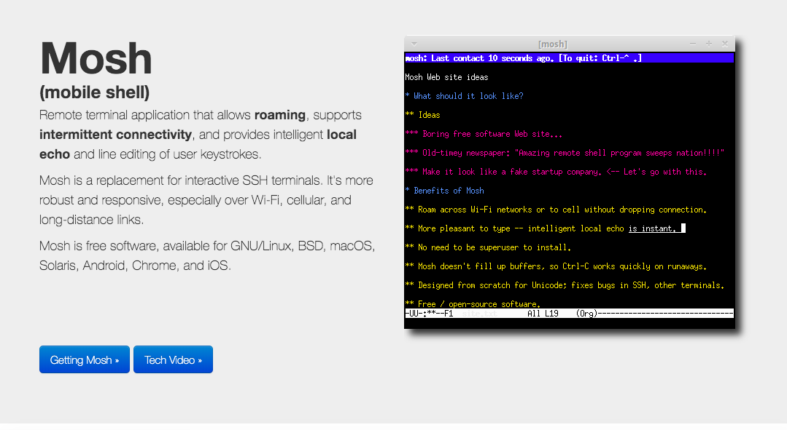

# Bash

bash shell 無法做到歷史指令補全，必須使用zsh，兩者設計有根本上的不同

sad

# Fish

[Introduction of fish](https://noob.tw/fish-shell/)
[fish github](https://github.com/fish-shell/fish-shell)

# zsh

now macOS use zsh as default.
[why zsh](https://www.howtogeek.com/362409/what-is-zsh-and-why-should-you-use-it-instead-of-bash/)
[zsh github](https://github.com/ohmyzsh/ohmyzsh)

# iterm2 / tmux

1. iterm2 for mac only
2. tmux (cross platform) but hard to learn.

# mosh

* 一個普遍遇到連接遠端機器的痛苦就是斷線(包含像是本地端shutdown, 本地端sleeping, 網路組態改變)
* 另一個痛苦則是連線變得越來越lag
* 關於這樣的問題是有解的，可以使用[Mosh](https://mosh.org/), the mobile shell

</img>
