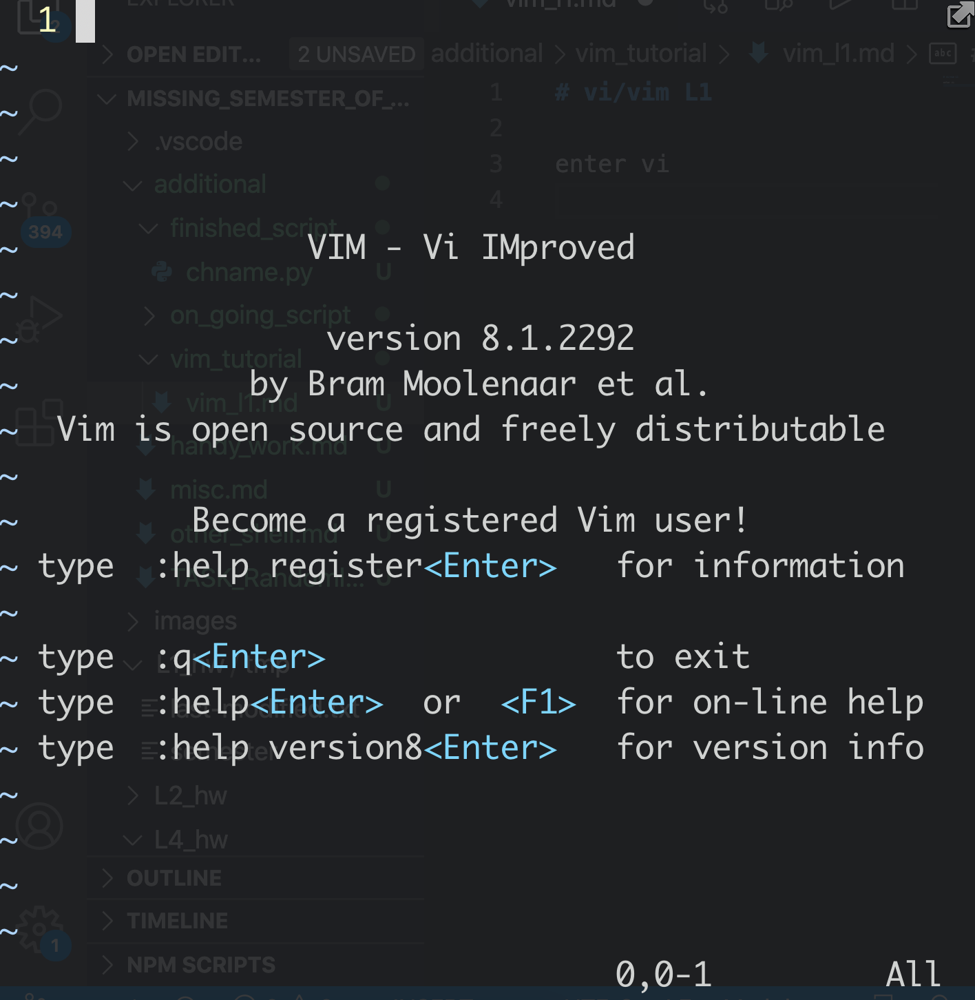

# vi/vim L1

enter `vi` from command line

</img>

1. command line mode

   1. enter `esc` from any type of mode.

2. last line mode

   1. it is a programming language ibnterface. Like 

      1. `wq` means : `write and quit`
      2. `q` means : `quit`
3. insert mode

   1. enter `i` from command line mode
